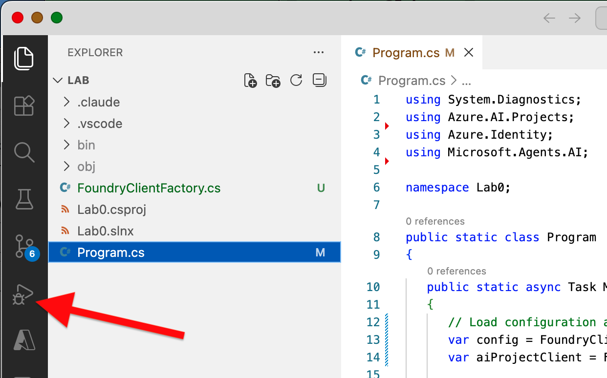
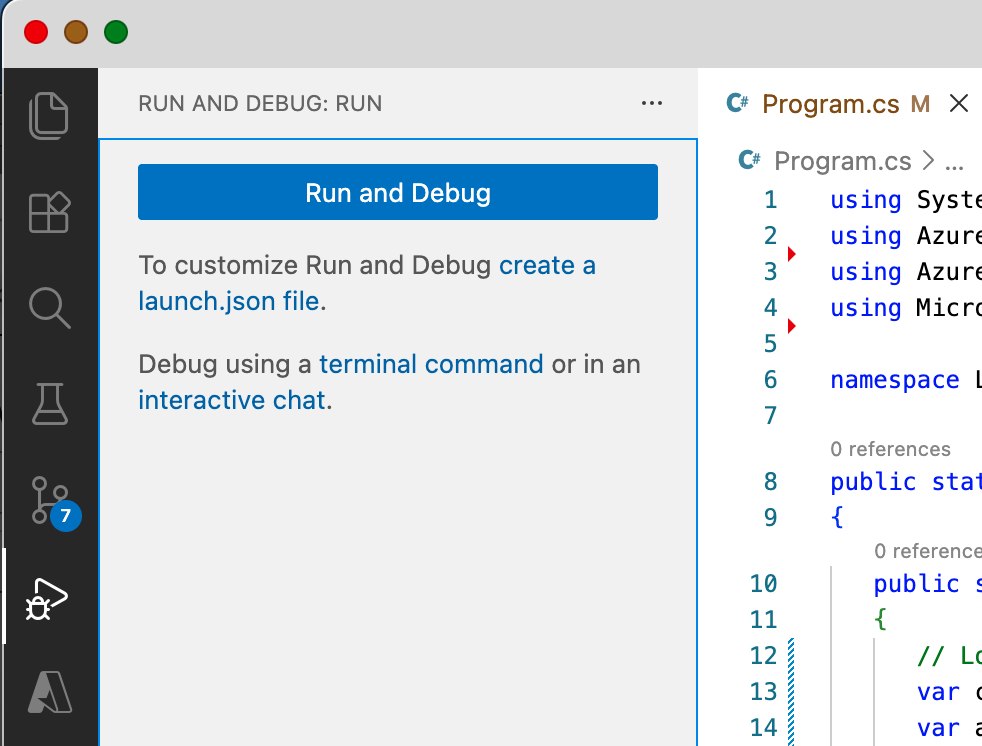
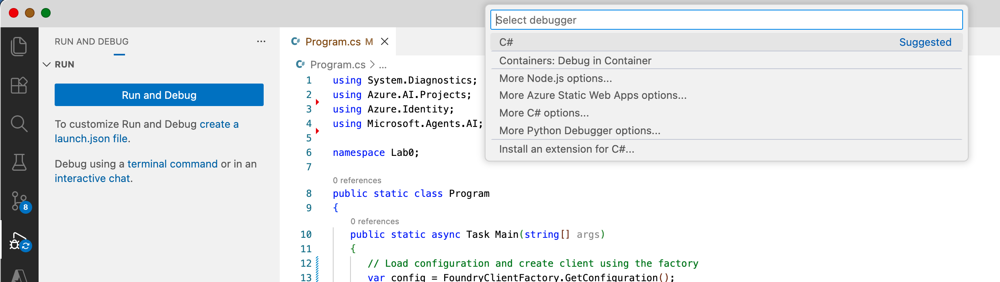
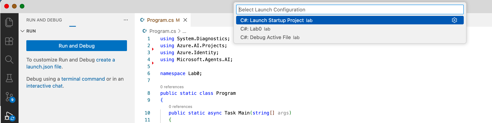
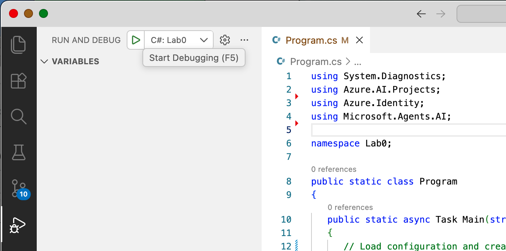
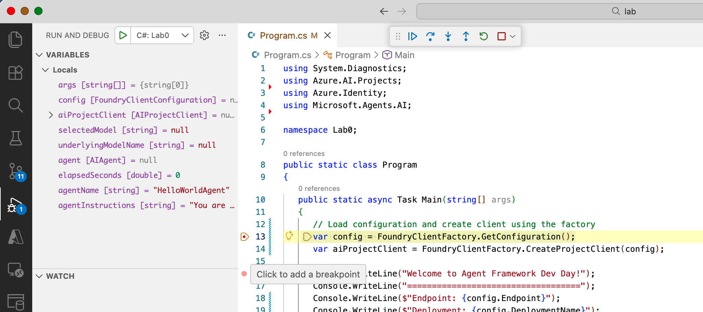

# How to run the labs

## Open individual Lab folders in VS Code

Example from `.../dotnet` directory.

## Mac/Linux example

```console
pwd
# .../agent-framework-dev-day/labs/dotnet
cd lab0/lab
code .
```

From there you can edit, debug, etc. When done, go to next.

```console
cd ../../lab1/lab
code .
```

Onward!

## Debugging

### Select the Debug tool in VS Code



### Click "Run and Debug" button



### Choose "C#" as suggested



### Choose Project (second option, here it shows Lab0)



### Click Start Debugging



### Click in "Gutter" to toggle breakpoints, use toolbar

