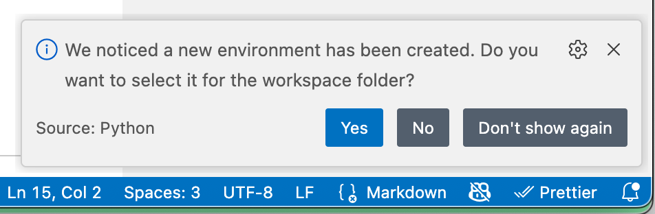

# Python Labs

Before entering a specific lab folder:

1. install the Python `venv` virtual environment (one line)
2. activate the Python `venv` virtual environment (one line)
3. install common dependencies (one line)
4. `cd` into a lab folder and start coding!

## Accept VS Code's offer to select the new Python environment

After you run `python -m venv .venv` (see instructions below) VS Code may pop up the following, to which we recommend you answer **Yes**.



For the curious, you can view the effects of this choice (or change or fix it) from the following:

Command Palette → "Python: Select Interpreter"

You can then adjust as needed, or just observe an cancel with ESC key.

## Windows (Command Prompt)

```console
# from .../labs/python
python -m venv .venv
.venv\Scripts\activate
# command prompt is now (.venv)
pip install -r requirements.txt
```console

## Windows (PowerShell)

```PowerShell
# from .../labs/python
python -m venv .venv
env\Scripts\Activate.ps1
# command prompt is now (.venv)
pip install -r requirements.txt
```

If you get an error about execution policies, consider this:

```PowerShell
CopySet-ExecutionPolicy -ExecutionPolicy RemoteSigned -Scope CurrentUser
```

## Mac, Linux

```console
# from .../labs/python
python -m venv .venv
source .venv/bin/activate
# command prompt is now (.venv)
pip install -r requirements.txt
# this changes prompt to (.venv)
```

## Start Labs

```console
cd lab0
python main.py
```

Onward!

## If you want to be tidy at the end

```console
# from any folder, as long as prompt is still (.venv)
deactivate
```
