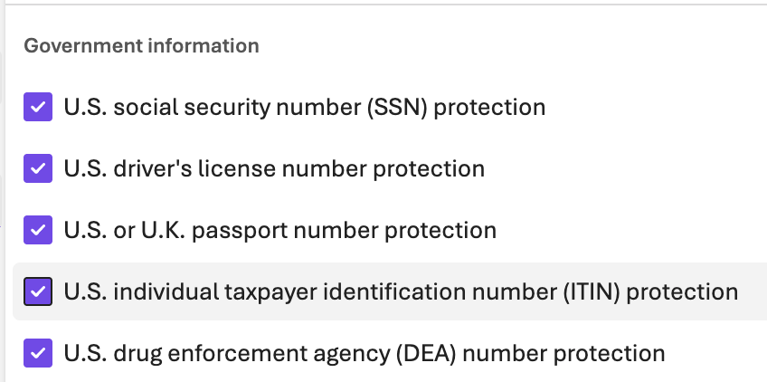

# Lab 1 - Model Safety Comparison

This lab explores how AI safety guardrails affect model responses.

STEP 1:

Run `dotnet run` and try the default prompt (just press Enter).
Observe how the two models respond differently to the same input.

STEP 2:

Try your own prompts! Compare responses between:

- **gpt-4.1-mini-safety** - Model with safety guardrails enabled
- **gpt-4.1-mini-no-safety** - Model without safety guardrails

## Guardrails

The "safety" model has extra guardrails (see demo) and the "no-safety" model has some default guardrails turned down or off.

## Things to notice

1. Does the safety model refuse certain requests? See "Examples" below for ideas.
2. Does safety add response time?
3. Try edge cases - what triggers safety guardrails?
4. When you substitute other models that have the "default" safety settings (in between these two) - what happens?

## Resources

- [Microsoft Foundry Guardrails](https://learn.microsoft.com/en-us/azure/ai-foundry/guardrails/guardrails-overview?view=foundry)

## Examples you can try

### Profanity

Can be deploy via curated blocklist.

You know the words and phrases. Shhh... Be discreet.

### SSN or similar

### Other PII

